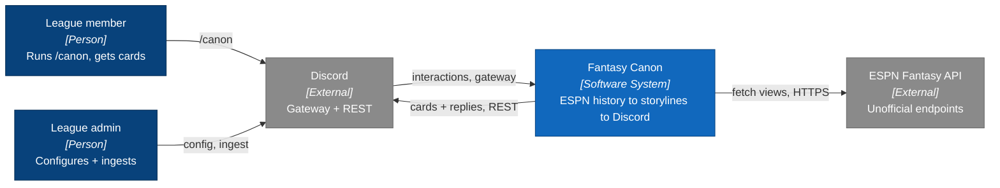
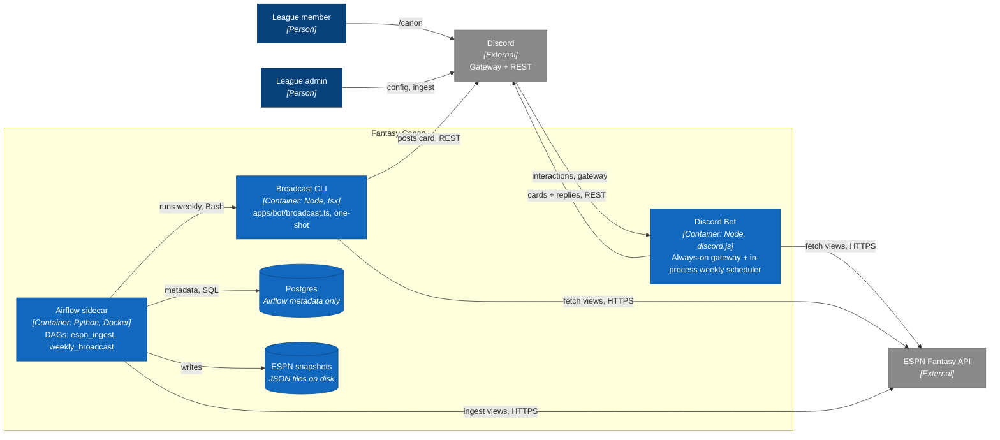
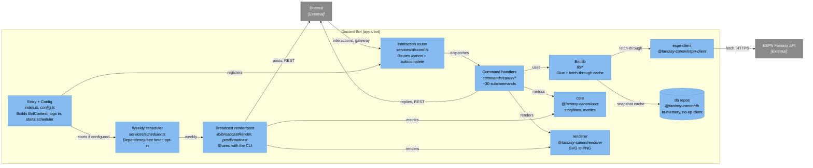

# System Architecture (Fantasy Canon)

Architecture as [C4](https://c4model.com/) diagrams — **Context → Container → Component** — drawn as
styled [Mermaid](https://mermaid.js.org/syntax/flowchart.html) flowcharts, which GitHub renders
inline (no build step, no committed images, stays diffable). Colors follow C4 convention: people and
the focus system/containers in blue, external systems in gray, data stores as cylinders.

This doc is the single source of truth for **what talks to what**. It reflects `main` **plus the ops
chain (#95–#97)** and calls out placeholders honestly rather than drawing the aspirational MVP. For
the package layout behind these views see [`05-repository-structure.md`](05-repository-structure.md);
for the scheduling decision see [ADR 0002](decisions/0002-scheduling-airflow.md); for the Airflow
sidecar see [`orchestration/README.md`](../orchestration/README.md).

> **Honest-state callouts (read these before the diagrams):**
>
> - **No live app database.** `packages/db` ships in-memory repos plus a no-op `NoopDbClient`; the
>   bot wires the **in-memory repos**, so nothing is persisted. The only Postgres is Airflow's
>   **metadata** DB. The
>   [target data model](#target-data-model-not-yet-persisted) below is where persistence is _headed_,
>   not what runs today.
> - **Scheduling is not `node-cron`.** The weekly post runs on a dependency-free, self-rescheduling
>   timer inside the always-on bot (`services/scheduler.ts`) — the hobby-scale production runtime per
>   [ADR 0002](decisions/0002-scheduling-airflow.md). Airflow is local-first dev + the broader ingest
>   pipeline, and remains a _valid_ broadcast path via the CLI.
> - **`apps/api` is a stub** (logs a message; no server). It appears in no diagram until it does
>   something.

## C4 Level 1 — System Context

Two human roles drive one system that sits between **Discord** (how people reach it) and the
**ESPN Fantasy API** (where the data comes from). Both external systems are things we don't control:
Discord is the chat platform; ESPN's league endpoints are _unofficial_.

## C4 Level 2 — Container

The system is **two runtimes** plus two data stores:

- **Discord Bot** — the always-on Node process. It is the production runtime for _both_ on-demand
  `/canon` commands _and_ (via its in-process scheduler) the weekly broadcast.
- **Airflow sidecar** — a local-first Python/Docker stack (custom image with Node + pnpm + the baked
  repo, issue #96). It owns the ESPN ingest pipeline and can _also_ drive the weekly broadcast by
  shelling out to the **Broadcast CLI**.

Note the **two paths to the same weekly post**: the bot's in-process scheduler (hobby default) and
`Airflow → Broadcast CLI` (dev / future hosted). Both reuse the exact same `renderBroadcast()` +
`postBroadcast()` code — the CLI is just a second entrypoint. Neither store below is the app DB:
Postgres holds Airflow metadata; snapshots are JSON files from the ingest DAG.

## C4 Level 3 — Component (Discord Bot internals)

Zooming into the bot container. An interaction arrives at the **router**, which dispatches to one of
~30 **`/canon` subcommands**. Each composes the shared packages (`core` for metrics/storylines,
`renderer` for cards, `espn-client` — usually via the bot's fetch-through cache) and replies over
REST. The **scheduler** is a parallel entry that reuses the **broadcast render/post** lib — the same
lib the standalone CLI calls. `shared` (types/config) underpins every package and is omitted from the
graph to reduce noise.

## Runtime & deployment (current)

- **One always-on Node process** (the bot) is the whole production runtime. It must stay connected to
  the gateway for slash commands anyway, so the weekly broadcast piggybacks on it via the in-process
  scheduler (opt-in through `BROADCAST_CHANNEL_ID` / `BROADCAST_SEASON`). No separate scheduler
  service to host.
- **Hosting** is the subject of the ops chain: #95 (register commands + secrets, done), #96 (Node-capable
  Airflow worker image), #97 (verify a real weekly post). A single always-free VM (e.g. GCP
  `e2-micro`) can carry the bot and, with `BROADCAST_*` set, the weekly post — no Airflow required in
  prod.
- **Airflow is local-first.** `orchestration/docker-compose.yaml` (Postgres + LocalExecutor
  webserver + scheduler) runs on your machine at ~$0; Cloud Composer is deliberately avoided
  (~$300–400/mo). It's for developing the ingest pipeline and as an alternate broadcast path, not the
  production cron.
- **Persistence is not wired.** The bot uses **in-memory repos** (the db package's `DbClient` is a
  no-op `NoopDbClient`); ESPN payloads are cached in-memory per process. Standing up a real Postgres
  (Supabase or otherwise) behind the repos is future work.

## Data flow

**On-demand command** (the live path):

1. Member runs a `/canon …` slash command; Discord delivers the interaction over the gateway.
2. The router dispatches to the handler, which fetches the needed ESPN views — most commands via the
   `ensureSnapshot` fetch-through cache (repo hit, else `espn-client` → save); a few admin commands
   hit `espn-client` directly.
3. The handler computes metrics/storylines in `core` and renders a card in `renderer`.
4. It replies to the interaction over REST (card PNG + text).

**Scheduled broadcast** (weekly, two equivalent entrypoints):

1. Trigger — either the bot's in-process scheduler (Tuesdays 16:00 UTC) or Airflow's
   `weekly_broadcast` DAG shelling out to the Broadcast CLI.
2. `renderBroadcast()` pulls snapshots, computes the metric (`power-ranking` / `standings`), renders
   the graph.
3. `postBroadcast()` posts to the configured channel via REST — no interaction, no gateway needed.

## Target data model (not yet persisted)

> ⚠️ **Not live.** The bot runs on **in-memory repos** today; no database is connected. This is the
> schema those repos (`snapshotsRepo`, `teamsRepo`, `transactionsRepo`, `leagueConfigRepo`,
> `canonEventsRepo`) are shaped for once a real Postgres is wired.

### `league_config`

- `guild_id` (discord server)
- `league_id`
- `start_season`
- `end_season`
- `post_channel_id`
- `timezone`
- `created_at`, `updated_at`

### `espn_snapshots`

- `id` (uuid)
- `league_id`
- `season`
- `view`
- `fetched_at`
- `payload` (jsonb)
- `hash` (optional)

### Derived tables (add as you go)

- `teams` (season-level team metadata)
- `team_week_scores` (week, teamId, points, oppId, result)
- `transactions` (adds/drops/trades, bid, time)
- `roster_entries` (week/team/player)
